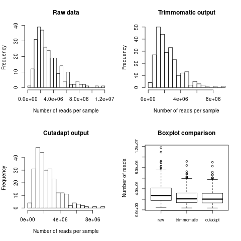
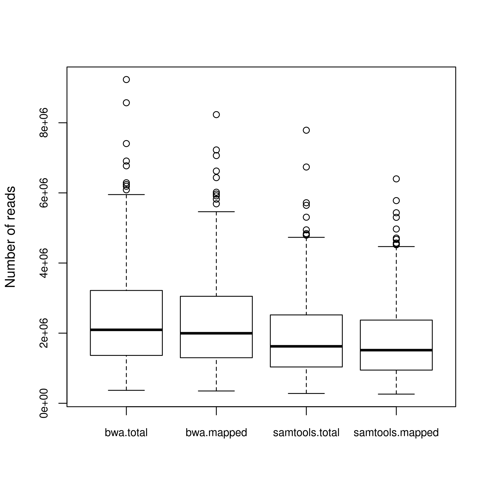

# ensete-tGBS
Ensete tGBS methodology

This readme file details the methodolgy used in the analysis of ensete tGBS data. All work was completed on the QMUL apocrita cluster.

## Table of contents

[Pre-processing of tGBS data](#pre-processing-of-tgbs-data)
   - [Import data from local hard drive into apocrita](#import-data-from-local-hard-drive-into-apocrita)
   - [Create sample list to iterate through](#create-sample-list-to-iterate-through)
   - [Use trimmomatic to filter raw reads](#use-trimmomatic-to-filter-raw-reads)
   - [Use cutadapt to filter reads without restriction enzyme cutsites](#use-cutadapt-to-filter-reads-without-restriction-enzyme-cutsites)
   - [Get sample read counts for data2bio raw, trimmomatic and cutadapt](#get-sample-read-counts-for-data2bio-raw-trimmomatic-and-cutadapt)

[Stacks ref map pipeline](#stacks-ref-map-pipeline)
   - [BWA](#bwa)
   - [Samtools](#samtools)
   - [Gstacks](#gstacks)
   - [Populations](#populations)

[Post-processing of SNP data](#post-processing-of-snp-data)
   - [Filtering duplicated loci](#filtering-duplicated-loci)  
   - [Create blacklist for duplicated loci](#create-blacklist-for-duplicated-loci) 
   - [rerun populations with blacklists](rerun-populations-with-blacklists)


      

## Pre-processing of tGBS data

### Import data from local hard drive into apocrita
Set up directory for raw data

`mkdir /data/scratch/mpx469/Data2Bio_final`

Run in local terminal

```
rsync -avz --partial /drives/f/Genomic_data/Data2Bio_final/raw mpx469@login.hpc.qmul.ac.uk:/data/scratch/mpx469/Data2Bio_final
rsync -avz --partial /drives/f/Genomic_data/Data2Bio_final/trimmed mpx469@login.hpc.qmul.ac.uk:/data/scratch/mpx469/Data2Bio_final
rsync -avz --partial /drives/f/Genomic_data/Data2Bio_final/genome mpx469@login.hpc.qmul.ac.uk:/data/scratch/mpx469/Data2Bio_final
rsync -avz --partial /drives/f/Genomic_data/Data2Bio_final/alignment.BAM mpx469@login.hpc.qmul.ac.uk:/data/scratch/mpx469/Data2Bio_final
```
Set file permissions of Data2Bio directory

```
chmod -R u=rwx,g=r,o=r Data2Bio_final
```

Import sample meta data into /data/scratch/mpx469 in .csv and .txt formats

```
head GBS_metadata.txt
SEQUENCE_ID     SAMPLE_ID       POPULATION      TYPE    sample_id       Landrace_2      _latitude       _longitude      Unique_code     Sample_date
EXS11ID000851.digested.trimmed.fq.gz    EXS11ID000851   1       Domestic        851     Chamo   6.191268003     37.57450757     031c0c90-0ac4-4f68-8f69-d960eaecb705    2018-10-18
EXS12ID000488.digested.trimmed.fq.gz    EXS12ID000488   1       Domestic        488     Worsaife        6.049165501     37.22941625     5a728129-b1e3-4781-9890-756b87133039    2018-10-20
EXS13ID000895.digested.trimmed.fq.gz    EXS13ID000895   1       Domestic        895     Arooko  7.933571263     36.51323982     c6b997b2-95b1-4b8b-89e3-a15fbeb4303e    2018-10-24
EXS16ID000913.digested.trimmed.fq.gz    EXS16ID000913   1       Domestic        913     Unknown_green   9.037241562     37.42883203     d873d0e5-70ef-4e53-a47f-144583374165    2018-10-25
EXS17ID000914.digested.trimmed.fq.gz    EXS17ID000914   1       Domestic        914     Unknown_red     9.037225949     37.4289773      d873d0e5-70ef-4e53-a47f-144583374165    2018-10-25
EXS1ID000384.digested.trimmed.fq.gz     EXS1ID000384    1       Domestic        384     Ganticha        6.774082442     38.43834313     835c3a82-4e2d-4851-bc81-edafefc6b651    2018-04-02
EXS5ID000604.digested.trimmed.fq.gz     EXS5ID000604    1       Domestic        604     Toracho 6.137371431     38.1996072      8b3cb20c-10fd-41c4-8cf4-0316c66bde65    2018-04-04
EXS8ID000683.digested.trimmed.fq.gz     EXS8ID000683    1       Domestic        683     Wanade  6.778954922     37.76874955     7596b9e7-27ca-4a7c-987f-426956b161e2    2018-04-10
P1EN003.digested.trimmed.fq.gz  P1EN003 1       Domestic        162     Achachet        8.491123519     38.01776645     0f21ebee-c784-4174-9e60-a046b3f5ab97    2018-01-27
```


### Create sample list to iterate through

```
# set dir
cd /data/scratch/mpx469

# get list from metadata
cut -f 2 GBS_metadata.txt | tail -n +2 > sample-list.txt

```


### Use trimmomatic to filter raw reads

```
# set dir
mkdir /data/scratch/mpx469/trimmomatic
mkdir /data/scratch/mpx469/trimmomatic/trimmomatic-output
mkdir /data/scratch/mpx469/trimmomatic/trimmomatic-job-files

cd /data/scratch/mpx469/trimmomatic

qsub script-trimmomatic-array.sh

# tidy up jobfiles
mv job-trimmomatic-array.o* trimmomatic-job-files/

# all jobs should have run successfully
cat trimmomatic-job-files/job-trimmomatic-array.o* | grep -e "TrimmomaticSE: Completed successfully" -c
# should return 283
```


### Use cutadapt to filter reads without restriction enzyme cutsites

```
# set dir
mkdir /data/scratch/mpx469/cutadapt
mkdir /data/scratch/mpx469/cutadapt/cutadapt-output
mkdir /data/scratch/mpx469/cutadapt/cutadapt-job-files

cd /data/scratch/mpx469/cutadapt

qsub script-cutadapt-array.sh

# tidy up jobfiles
mv job-cutadapt-array.o* cutadapt-job-files/

# all jobs should have run successfully
cat cutadapt-job-files/job-cutadapt-array.o* | grep Summary -c
# should return 283
```


### Get sample read counts for data2bio raw, trimmomatic and cutadapt

```
mkdir /data/scratch/mpx469/read-count
cd /data/scratch/mpx469/read-count

qsub script-read-number-count.sh
```

Get summary statisitics and create plots

```
module add R/3.6.1
Rscript Rscript-read-number-count-summary.R
```

**Table of summarys statistics** 
A full summary on an invididual basis can be found in the supplementary materials.

|         | raw (M) | trimmomatic (M) | removed by trimmomatic (%) | cutadapt (M)| removed by cutadapt (%) |
|---------|---------|-----------------|----------------------------|-------------|-------------------------|
| Total   |	832.11  | 639.73          | 0.23                       | 623.05      | 0.03                    |
| Mean	 | 3.20    | 2.46            | 0.23                       | 2.40        | 0.03                    |
| Min	    | 0.47    | 0.37            | 0.20                       | 0.36        | 0.01                    |
| Max	    | 11.80   | 9.18            | 0.32                       | 9.02        | 0.08                    |


**Read count histograms and boxplot**



## Stacks ref map pipeline

### BWA

Create genome index and map reads to genome using BWA 

```
mkdir /data/scratch/mpx469/bwa/bwa-mem-output
mkdir /data/scratch/mpx469/bwa/bwa-mem-jobfiles
mkdir /data/scratch/mpx469/bwa/cutadapt-fq
cd /data/scratch/mpx469/bwa

# copy across genome
cp /data/SBCS-Ethiopia/databases/genomes/enset/GCA_000331365.3_Ensete_JungleSeeds_v3.0_genomic.fna.gz .

# gunzip
gunzip GCA_000331365.3_Ensete_JungleSeeds_v3.0_genomic.fna.gz

# index genome
qsub script-bwa-index.sh

# map trimmomatic output to reference
qsub script-bwa-mem.sh

# tidy up job files
mv job-bwa-mem.o* bwa-mem-jobfiles/

# should be 283
cat bwa-mem-jobfiles/job-bwa-mem.o* | grep -e "Real time" -c
```


### Samtools

Filter reads that are not mapped uniquely, flagged as alternative (XA:Z) or chimeric (SA:Z) alignments

```
mkdir /data/scratch/mpx469/samtools
mkdir /data/scratch/mpx469/samtoools/samtools-output
mkdir /data/scratch/mpx469/samtoools/samtools-job-files

cd /data/scratch/mpx469/samtools

qsub script-samtools.sh

# tidy up job files
mv job-samtools.o* samtools-job-files/

# should be 283
cat samtools-job-files/job-samtools.* | grep -e "all mapped reads are unique" -c

# get summary counts for mapped reads
qsub script-summary-flagstat-counts.sh

module add R/3.6.1
Rscript Rscript-summary-flagstat-counts.R
```

**Total and mapped reads from BWA and samtools**




### Gstacks

```
mkdir /data/scratch/mpx469/STACKS
mkdir /data/scratch/mpx469/STACKS/gstacks
mkdir /data/scratch/mpx469/STACKS/gstacks/gstacks-together-output
mkdir /data/scratch/mpx469/STACKS/gstacks/gstacks-separate-output

cd /data/scratch/mpx469/STACKS/gstacks
```

Create popmap, filtering out samples classed as "Disease" or "NA". two pomap files are generate, one grouping all individuals as a single population, the other treating samples separately. 

```
Rscript Rscript-write-popmap-selection.R

 head popmap-selection-*
==> popmap-selection-separate.txt <==
EXS11ID000851.mapped.unique.sorted      1
EXS12ID000488.mapped.unique.sorted      2
EXS13ID000895.mapped.unique.sorted      3
EXS16ID000913.mapped.unique.sorted      4
EXS17ID000914.mapped.unique.sorted      5
EXS1ID000384.mapped.unique.sorted       6
EXS5ID000604.mapped.unique.sorted       7
EXS8ID000683.mapped.unique.sorted       8
P1EN003.mapped.unique.sorted    9
P1EN004.mapped.unique.sorted    10

==> popmap-selection-together.txt <==
EXS11ID000851.mapped.unique.sorted      1
EXS12ID000488.mapped.unique.sorted      1
EXS13ID000895.mapped.unique.sorted      1
EXS16ID000913.mapped.unique.sorted      1
EXS17ID000914.mapped.unique.sorted      1
EXS1ID000384.mapped.unique.sorted       1
EXS5ID000604.mapped.unique.sorted       1
EXS8ID000683.mapped.unique.sorted       1
P1EN003.mapped.unique.sorted    1
P1EN004.mapped.unique.sorted    1
```

Run gstacks

```
qsub script-gstacks-together.sh
qsub script-gstacks-separate.sh
```


### Populations

Run populatios using the popmaps created above

```
mkdir /data/scratch/mpx469/STACKS/populations

mkdir /data/scratch/mpx469/STACKS/populations/populations-separate-all-snps-R80-default-1
mkdir /data/scratch/mpx469/STACKS/populations/populations-separate-all-snps-R80-maf-het-1
mkdir /data/scratch/mpx469/STACKS/populations/populations-separate-single-snp-R80-default-1
mkdir /data/scratch/mpx469/STACKS/populations/populations-separate-single-snp-R80-maf-het-1
mkdir /data/scratch/mpx469/STACKS/populations/populations-together-all-snps-r80-default-1

cd /data/scratch/mpx469/STACKS/populations

qsub script-populations-separate-all-snps-R80-default-1.sh
qsub script-populations-separate-all-snps-R80-maf-het-1.sh
qsub script-populations-separate-single-snp-R80-default-1.sh
qsub script-populations-separate-single-snp-R80-maf-het-1.sh
qsub script-populations-together-all-snps-r80-default-1.sh

```


## Post-processing of SNP data

### Filtering duplicated loci 

Stacks assembles and defines loci with the same 5' startng point. A smll number of tGBS loci have different 5' start posiionts and appear in the vcf file as duplicate loci. An example of this is shown below, idenfited in IGV viewer.

** insert more recent image **

These loci need to be filtered out prior to analyses. 

#### Create blacklist for duplicated loci 

```
mkdir /data/scratch/mpx469/STACKS/blacklist-duplicates
mkdir /data/scratch/mpx469/STACKS/blacklist-duplicates/blacklist-separate-all-snps-R80-default
mkdir /data/scratch/mpx469/STACKS/blacklist-duplicates/blacklist-separate-all-snps-R80-maf-het
mkdir /data/scratch/mpx469/STACKS/blacklist-duplicates/blacklist-separate-single-snp-R80-default
mkdir /data/scratch/mpx469/STACKS/blacklist-duplicates/blacklist-separate-single-snp-R80-maf-het
mkdir /data/scratch/mpx469/STACKS/blacklist-duplicates/blacklist-together-all-snps-r80-default

bash script-blacklist-separate-all-snps-R80-default.sh
bash script-blacklist-separate-all-snps-R80-maf-het.sh
bash script-blacklist-separate-single-snp-R80-default.sh
bash script-blacklist-separate-single-snp-R80-maf-het.sh
bash script-blacklist-together-all-snps-r80-default.sh
```


##### rerun populations with blacklists

```
cd /data/scratch/mpx469/STACKS/populations

mkdir /data/scratch/mpx469/STACKS/populations/populations-separate-all-snps-R80-default-2-blacklist
mkdir /data/scratch/mpx469/STACKS/populations/populations-separate-all-snps-R80-maf-het-2-blacklist
mkdir /data/scratch/mpx469/STACKS/populations/populations-separate-single-snp-R80-default-2-blacklist
mkdir /data/scratch/mpx469/STACKS/populations/populations-separate-single-snp-R80-maf-het-2-blacklist
mkdir /data/scratch/mpx469/STACKS/populations/populations-together-all-snps-r80-default-2-blacklist

qsub script-populations-separate-all-snps-R80-default-2-blacklist.sh
qsub script-populations-separate-all-snps-R80-maf-het-2-blacklist.sh
qsub script-populations-separate-single-snp-R80-default-2-blacklist.sh
qsub script-populations-separate-single-snp-R80-maf-het-2-blacklist.sh
qsub script-populations-together-all-snps-r80-default-2-blacklist.sh

```


