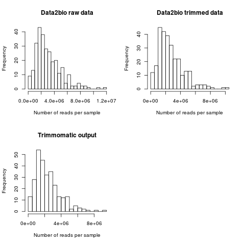
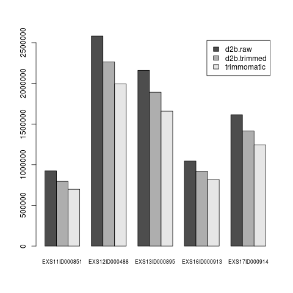
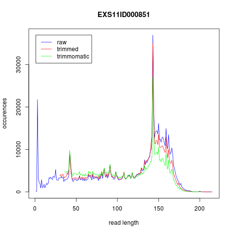
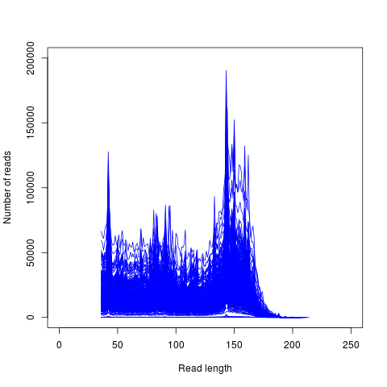
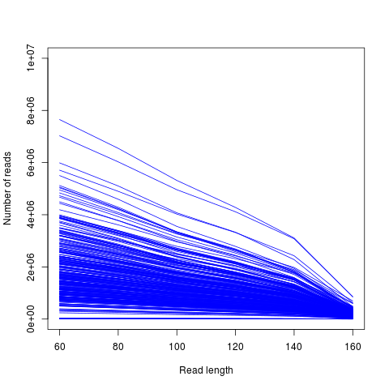

# ensete-tGBS
Ensete tGBS methodology

This readme file details the methodolgy used in the analysis of ensete tGBS data. All work was completed on the QMUL apocrita cluster.

### Import data from local hard drive into apocrita
Set up directory for raw data

`mkdir /data/scratch/mpx469/Data2Bio_final`

Run in local terminal

```
rsync -avz --partial /drives/f/Genomic_data/Data2Bio_final/raw mpx469@login.hpc.qmul.ac.uk:/data/scratch/mpx469/Data2Bio_final
rsync -avz --partial /drives/f/Genomic_data/Data2Bio_final/trimmed mpx469@login.hpc.qmul.ac.uk:/data/scratch/mpx469/Data2Bio_final
rsync -avz --partial /drives/f/Genomic_data/Data2Bio_final/genome mpx469@login.hpc.qmul.ac.uk:/data/scratch/mpx469/Data2Bio_final
rsync -avz --partial /drives/f/Genomic_data/Data2Bio_final/alignment.BAM mpx469@login.hpc.qmul.ac.uk:/data/scratch/mpx469/Data2Bio_final
```
Set file permissions of Data2Bio directory

```
chmod -R u=rwx,g=r,o=r Data2Bio_final
```

Import sample meta data into /data/scratch/mpx469 in .csv and .txt formats

```
head GBS_metadata.txt
SEQUENCE_ID     SAMPLE_ID       POPULATION      TYPE    sample_id       Landrace_2      _latitude       _longitude      Unique_code     Sample_date
EXS11ID000851.digested.trimmed.fq.gz    EXS11ID000851   1       Domestic        851     Chamo   6.191268003     37.57450757     031c0c90-0ac4-4f68-8f69-d960eaecb705    2018-10-18
EXS12ID000488.digested.trimmed.fq.gz    EXS12ID000488   1       Domestic        488     Worsaife        6.049165501     37.22941625     5a728129-b1e3-4781-9890-756b87133039    2018-10-20
EXS13ID000895.digested.trimmed.fq.gz    EXS13ID000895   1       Domestic        895     Arooko  7.933571263     36.51323982     c6b997b2-95b1-4b8b-89e3-a15fbeb4303e    2018-10-24
EXS16ID000913.digested.trimmed.fq.gz    EXS16ID000913   1       Domestic        913     Unknown_green   9.037241562     37.42883203     d873d0e5-70ef-4e53-a47f-144583374165    2018-10-25
EXS17ID000914.digested.trimmed.fq.gz    EXS17ID000914   1       Domestic        914     Unknown_red     9.037225949     37.4289773      d873d0e5-70ef-4e53-a47f-144583374165    2018-10-25
EXS1ID000384.digested.trimmed.fq.gz     EXS1ID000384    1       Domestic        384     Ganticha        6.774082442     38.43834313     835c3a82-4e2d-4851-bc81-edafefc6b651    2018-04-02
EXS5ID000604.digested.trimmed.fq.gz     EXS5ID000604    1       Domestic        604     Toracho 6.137371431     38.1996072      8b3cb20c-10fd-41c4-8cf4-0316c66bde65    2018-04-04
EXS8ID000683.digested.trimmed.fq.gz     EXS8ID000683    1       Domestic        683     Wanade  6.778954922     37.76874955     7596b9e7-27ca-4a7c-987f-426956b161e2    2018-04-10
P1EN003.digested.trimmed.fq.gz  P1EN003 1       Domestic        162     Achachet        8.491123519     38.01776645     0f21ebee-c784-4174-9e60-a046b3f5ab97    2018-01-27
```


### Create sample list to iterate through

```
# set dir
cd /data/scratch/mpx469

# get list from metadata
cut -f 2 GBS_metadata.txt | tail -n +2 > sample-list.txt

```


### Use trimmomatic to filter raw reads

```
# set dir
mkdir /data/scratch/mpx469/trimmomatic
mkdir /data/scratch/mpx469/trimmomatic/trimmomatic-output
cd /data/scratch/mpx469/trimmomatic

qsub script-trimmomatic-array.sh
```

Note LEADING paramter not used, in attempt to preserve the 5' end of the GBS loci which are used to align stacks

```
# tidy up jobfiles
mkdir trimmomatic-output/jobfiles
cp job-trimmomatic-array.o* trimmomatic-output/jobfiles/

# all jobs should have run successfully
cat trimmomatic-output/jobfiles/job-trimmomatic-array.o* | grep -e "TrimmomaticSE: Completed successfully" -c
# should return 283
```


### Get sample read counts for data2bio raw, data3bio trimmed and trimmomatic

```
mkdir /data/scratch/mpx469/read-count
cd /data/scratch/mpx469/read-count

qsub script-read-number-count.sh
```

Create plots

```
module add R
Rscript Rscript-plot-read-number-count.R
```

**Read count histograms**



**Read counts for samples one to five only**




### Read length distributions

Ion proton sequencing has variable read lengths. Quantify read lengths in a given sample, raw and trimmed. Code adapted from https://www.biostars.org/p/72433/#72441

```
mkdir /data/scratch/mpx469/read-length-distribution
cd /data/scratch/mpx469/read-length-distribution

# compare read length distributions of a single sample for the different trimming options
mkdir /data/scratch/mpx469/read-length-distribution/single-sample-comparison
cd /data/scratch/mpx469/read-length-distribution/single-sample-comparison/

# get read lengths
zcat /data/scratch/mpx469/Data2Bio_final/raw/EXS11ID000851.digested.fq.gz | awk '{if(NR%4==2) print length($1)}' | sort -n | uniq -c > read_length.EXS11ID000851.digested.txt
zcat /data/scratch/mpx469/Data2Bio_final/trimmed/EXS11ID000851.digested.trimmed.fq.gz | awk '{if(NR%4==2) print length($1)}' | sort -n | uniq -c > read_length.EXS11ID000851.digested.trimmed.txt
zcat /data/scratch/mpx469/trimmomatic/trimmomatic-output/EXS11ID000851.digested.trimmomatic.fq.gz | awk '{if(NR%4==2) print length($1)}' | sort -n | uniq -c > read_length.EXS11ID000851.digested.trimmomatic.txt

# column 1 is the number of sequnces
# column 2 is the length category
```

Create plot

```
Rscript Rscript-plot-single-sample-comparison.R
```

**Read length distribution for a single sample**




### Get read length distributions for all trimmomatic samples

```
mkdir /data/scratch/mpx469/read-length-distribution/read-length-distribution-trimmomatic
mkdir /data/scratch/mpx469/read-length-distribution/read-length-distribution-trimmomatic/output-read-length-distribution-trimmomatic

cd /data/scratch/mpx469/read-length-distribution/read-length-distribution-trimmomatic/

qsub script-read-length-distribution-trimmomatic.sh

```
Create plot 

```
Rscript Rscript-plot-read-length-distribution-trimmomatic.R
```
**Read length distribution of all trimmomatic samples**

Plot is overcrowded and there is likely to be a better way of averaing across? Note that certain samples appear to have very few reads



**Number of trimmomatic reads after truncating to a uniform length**

This would only be important if we decide to use a denovo methodology




### stacks pipeline reference guided - BWA

Create genome index and map reads to genome using BWA 

```
mkdir /data/scratch/mpx469/stacks/ref-map/
mkdir /data/scratch/mpx469/stacks/ref-map/bwa
cd /data/scratch/mpx469/stacks/ref-map/bwa

# copy across genome
cp /data/SBCS-Ethiopia/databases/genomes/enset/GCA_000331365.3_Ensete_JungleSeeds_v3.0_genomic.fna.gz .

gunzip GCA_000331365.3_Ensete_JungleSeeds_v3.0_genomic.fna.gz

# index genome
qsub script-bwa-index.sh

# map trimmomatic output to reference

mkdir bwa-map-output
mkdir trimmomatic-fq

qsub script-bwa-mem.sh

# tidy up job files
mkdir bwa-map-output/job-files
mv job-bwa-map.o* bwa-map-output/job-files/

# should be 283
cat bwa-map-output/job-files/job-bwa-map.o* | grep -e "Real time" -c
```


### stacks pipeline reference guided - samtools

```
mkdir /data/scratch/mpx469/stacks/ref-map/samtools
cd /data/scratch/mpx469/stacks/ref-map/samtools

mkdir samtools-output

qsub script-samtools-filter-sort-index.sh

# tidy up job files
mkdir samtools-output/job-files
mv job-samtools.o* samtools-output/job-files/

# should be 283
cat samtools-output/job-files/job-samtools.* | grep -e "all good" -c

```

How many reads filtered and mapped 

```
script-samtools-flagstat.sh

# job files not needed or useful
rm job-samtools-flagstat.o*
```

Create plot

```

mkdir flagstat-plot

cat /data/scratch/mpx469/sample-list.txt | while read i; do  
   head -n 1 samtools-output/${i}.flagstat.txt | cut -f 1 -d " "; 
done > flagstat-plot/reads-total.txt

cat /data/scratch/mpx469/sample-list.txt | while read i; do  
   head -n 1 samtools-output/${i}.flagstat.filtered.txt | cut -f 1 -d " "; 
done > flagstat-plot/reads-unique.txt

cat /data/scratch/mpx469/sample-list.txt | while read i; do  
   awk 'NR==5' samtools-output/${i}.flagstat.filtered.txt | cut -f 1 -d " "; 
done > flagstat-plot/reads-unique-mapped.txt

Rscript Rscript-samtools-flagstat-plot.R
```

**Proportion of unique and uniqule maped reads**


### stacks pipeline reference guided - gstacks

# AQUI

```
mkdir /data/scratch/mpx469/stacks/ref-map/gstacks
cd /data/scratch/mpx469/stacks/ref-map/gstacks

# run gstacks after removing unneccessary samples (Disease or NA)
# run as all sample lumped together and all samples treated separately


module add R
R

sample.metadata <- read.csv("/data/scratch/mpx469/GBS_metadata.csv", header=TRUE, na.strings=NULL)

# filter out disease and NA samples
sample.metadata <- sample.metadata[-which(sample.metadata$TYPE == "Disease" | sample.metadata$TYPE == "NA"),]

samples <- paste(sample.metadata$SAMPLE_ID, ".mapped.unique.sorted", sep="")

population.together <- rep(1, length(samples))
population.separate <- 1:length(samples)

popmap.together <- cbind(samples, population.together)
popmap.separate <- cbind(samples, population.separate)

write.table(file="popmap-selection-together.txt", popmap.together, col.names=FALSE, row.names=FALSE, quote=FALSE, sep="\t")
write.table(file="popmap-selection-separate.txt", popmap.separate, col.names=FALSE, row.names=FALSE, quote=FALSE, sep="\t")

q(save="no")

mkdir gstacks-together-output
mkdir gstacks-separate-output


cat script-gstacks-together.sh
#!/bin/sh
#$ -cwd
#$ -j y
#$ -pe smp 12
#$ -l h_rt=12:0:0
#$ -l h_vmem=2G
#$ -N job-gstacks-together

module load use.dev
module add stacks/2.41

gstacks \
   -I /data/scratch/mpx469/stacks/ref-map/samtools/samtools-output/ \
   -M popmap-selection-together.txt \
   -O gstacks-together-output \
   -t 12

cat script-gstacks-separate.sh
#!/bin/sh
#$ -cwd
#$ -j y
#$ -pe smp 12
#$ -l h_rt=12:0:0
#$ -l h_vmem=2G
#$ -N job-gstacks-separate

module load use.dev
module add stacks/2.41

gstacks \
   -I /data/scratch/mpx469/stacks/ref-map/samtools/samtools-output/ \
   -M popmap-selection-separate.txt \
   -O gstacks-separate-output \
   -t 12

qsub script-gstacks-together.sh
qsub script-gstacks-separate.sh
```


### stacks pipeline reference guided - populations

Run populations after removing unneccessary samples (Disease or NA)

Also run and as all sample lumped together as a single populaytion and and all samples treated separately

```
mkdir /data/scratch/mpx469/stacks/ref-map/populations
cd /data/scratch/mpx469/stacks/ref-map/populations

mkdir populations-together-output
mkdir populations-separate-output

cat script-populations-together.sh
#!/bin/bash
#$ -pe smp 12
#$ -l h_vmem=4G
#$ -l h_rt=2:0:0
#$ -cwd
#$ -j y
#$ -N job-populations-together

module load use.dev
module add stacks/2.41

populations \
   -P /data/scratch/mpx469/stacks/ref-map/gstacks/gstacks-together-output/ \
   -O populations-together-output \
   -M /data/scratch/mpx469/stacks/ref-map/gstacks/popmap-selection-together.txt \
   -r 0.4 \
   --vcf --plink --structure \
   -t 12

cat script-populations-separate.sh
#!/bin/bash
#$ -pe smp 12
#$ -l h_vmem=24G
#$ -l h_rt=10:0:0
#$ -l node_type=sm
#$ -l highmem
#$ -cwd
#$ -j y
#$ -N job-populations-separate

module load use.dev
module add stacks/2.41

populations \
   -P /data/scratch/mpx469/stacks/ref-map/gstacks/gstacks-separate-output/ \
   -O populations-separate-output \
   -M /data/scratch/mpx469/stacks/ref-map/gstacks/popmap-selection-separate.txt \
   -R 0.4 \
   --write-single-snp \
   --phylip --phylip-var --phylip-var-all --vcf \
   -t 12
```


### identify duplicated loci 

```
# how many mapped loci in total
grep -e ^# -v populations.snps.vcf | wc -l
576099

# how many mapped loci after filtering those with identical chromosome and position
# nout -u call needed to only print unique lines
grep -e ^# -v populations.snps.vcf | awk ' { print $1"\t"$2 } ' | sort | uniq -u | wc -l
570318

# how many lines represent duplicated loci
expr 576099 - 570318
5781

# check the number of duplicated lines
grep -e ^# -v populations.snps.vcf | awk ' { print $1"\t"$2 } ' | sort | uniq -D | wc -l
5781


# grep out info lines begining with #
# select first and second lines with chomosome and position
# sort
# uniq - filter for duplicate lines
#      -d only print duplicate lines, one for each group  
#      -c prefix lines by the number of occurrences
grep -e ^# -v populations.snps.vcf | awk ' { print $1"\t"$2 } ' | sort | uniq -dc > duplicated-sites.txt


module add R
R

x <- read.table("duplicated-sites.txt", header=FALSE)

head(x)
#  V1             V2    V3
#1  2 AMZH03000010.1 31526
#2  2 AMZH03000010.1 31541
#3  2 AMZH03000010.1 31546
#4  2 AMZH03000010.1 31548
#5  2 AMZH03000010.1 31555
#6  2 AMZH03000010.1 31564

sum(x$V1)
#[1] 5781

# add an empty column 
# I would like the to be a tab on the end of each line
x$V4 <- rep("", nrow(x))

write.table(x[,-1], "duplicated-sites-edit.txt", sep ="\t", col.names=FALSE, row.names=FALSE, quote=FALSE)

q(save="no")

grep -f duplicated-sites-edit.txt -c populations.snps.vcf
#5781

grep -f duplicated-sites-edit.txt -v populations.snps.vcf > populations.snps.duplicates.removed.vcf


grep -e ^# -v populations.snps.duplicates.removed.vcf | wc -l
#570318


wc -l duplicated-sites.txt
2871 duplicated-sites.txt

# what is the maximum number of duplicates
cut -f 7 -d " " duplicated-sites.txt | sort | uniq
2
3

grep -e ^# -v populations.snps.vcf | awk ' { print $1"\t"$2 } ' | sort | uniq -D > duplicated-sites-all.txt
```


