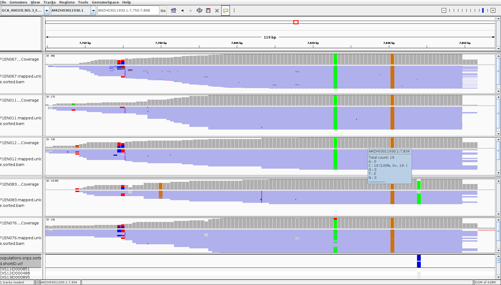

# ensete-tGBS
Ensete tGBS methodology

This readme file details the methodolgy used in the analysis of ensete tGBS data. All work was completed on the QMUL apocrita cluster.

## Table of contents

[Pre-processing of tGBS data](#pre-processing-of-tgbs-data)
   - [Import data from local hard drive into apocrita](#import-data-from-local-hard-drive-into-apocrita)
   - [Create sample list to iterate through](#create-sample-list-to-iterate-through)
   - [Use trimmomatic to filter raw reads](#use-trimmomatic-to-filter-raw-reads)
   - [Use cutadapt to filter reads without restriction enzyme cutsites](#use-cutadapt-to-filter-reads-without-restriction-enzyme-cutsites)
   - [Get sample read counts for data2bio raw, trimmomatic and cutadapt](#get-sample-read-counts-for-data2bio-raw-trimmomatic-and-cutadapt)
   - [Read length distributions](#read-length-distributions)
   - [Get read length distributions for all trimmomatic samples](#get-read-length-distributions-for-all-trimmomatic-samples)

[Stacks ref map pipeline](#stacks-ref-map-pipeline)
   - [BWA](#bwa)
   - [Samtools](#samtools)
   - [Gstacks](#gstacks)
   - [Populations](#populations)

[Post-processing of SNP data](#post-processing-of-snp-data)
   - [Filtering duplicated loci](#filtering-duplicated-loci)  
      - [Filter the populations together output](#filter-the-populations-together-output) 
      - [Filter the populations separate output](#filter-the-populations-separate-output)
      

## Pre-processing of tGBS data

### Import data from local hard drive into apocrita
Set up directory for raw data

`mkdir /data/scratch/mpx469/Data2Bio_final`

Run in local terminal

```
rsync -avz --partial /drives/f/Genomic_data/Data2Bio_final/raw mpx469@login.hpc.qmul.ac.uk:/data/scratch/mpx469/Data2Bio_final
rsync -avz --partial /drives/f/Genomic_data/Data2Bio_final/trimmed mpx469@login.hpc.qmul.ac.uk:/data/scratch/mpx469/Data2Bio_final
rsync -avz --partial /drives/f/Genomic_data/Data2Bio_final/genome mpx469@login.hpc.qmul.ac.uk:/data/scratch/mpx469/Data2Bio_final
rsync -avz --partial /drives/f/Genomic_data/Data2Bio_final/alignment.BAM mpx469@login.hpc.qmul.ac.uk:/data/scratch/mpx469/Data2Bio_final
```
Set file permissions of Data2Bio directory

```
chmod -R u=rwx,g=r,o=r Data2Bio_final
```

Import sample meta data into /data/scratch/mpx469 in .csv and .txt formats

```
head GBS_metadata.txt
SEQUENCE_ID     SAMPLE_ID       POPULATION      TYPE    sample_id       Landrace_2      _latitude       _longitude      Unique_code     Sample_date
EXS11ID000851.digested.trimmed.fq.gz    EXS11ID000851   1       Domestic        851     Chamo   6.191268003     37.57450757     031c0c90-0ac4-4f68-8f69-d960eaecb705    2018-10-18
EXS12ID000488.digested.trimmed.fq.gz    EXS12ID000488   1       Domestic        488     Worsaife        6.049165501     37.22941625     5a728129-b1e3-4781-9890-756b87133039    2018-10-20
EXS13ID000895.digested.trimmed.fq.gz    EXS13ID000895   1       Domestic        895     Arooko  7.933571263     36.51323982     c6b997b2-95b1-4b8b-89e3-a15fbeb4303e    2018-10-24
EXS16ID000913.digested.trimmed.fq.gz    EXS16ID000913   1       Domestic        913     Unknown_green   9.037241562     37.42883203     d873d0e5-70ef-4e53-a47f-144583374165    2018-10-25
EXS17ID000914.digested.trimmed.fq.gz    EXS17ID000914   1       Domestic        914     Unknown_red     9.037225949     37.4289773      d873d0e5-70ef-4e53-a47f-144583374165    2018-10-25
EXS1ID000384.digested.trimmed.fq.gz     EXS1ID000384    1       Domestic        384     Ganticha        6.774082442     38.43834313     835c3a82-4e2d-4851-bc81-edafefc6b651    2018-04-02
EXS5ID000604.digested.trimmed.fq.gz     EXS5ID000604    1       Domestic        604     Toracho 6.137371431     38.1996072      8b3cb20c-10fd-41c4-8cf4-0316c66bde65    2018-04-04
EXS8ID000683.digested.trimmed.fq.gz     EXS8ID000683    1       Domestic        683     Wanade  6.778954922     37.76874955     7596b9e7-27ca-4a7c-987f-426956b161e2    2018-04-10
P1EN003.digested.trimmed.fq.gz  P1EN003 1       Domestic        162     Achachet        8.491123519     38.01776645     0f21ebee-c784-4174-9e60-a046b3f5ab97    2018-01-27
```


### Create sample list to iterate through

```
# set dir
cd /data/scratch/mpx469

# get list from metadata
cut -f 2 GBS_metadata.txt | tail -n +2 > sample-list.txt

```


### Use trimmomatic to filter raw reads

```
# set dir
mkdir /data/scratch/mpx469/trimmomatic
mkdir /data/scratch/mpx469/trimmomatic/trimmomatic-output
mkdir /data/scratch/mpx469/trimmomatic/trimmomatic-job-files

cd /data/scratch/mpx469/trimmomatic

qsub script-trimmomatic-array.sh

# tidy up jobfiles
mv job-trimmomatic-array.o* trimmomatic-job-files/

# all jobs should have run successfully
cat trimmomatic-job-files/job-trimmomatic-array.o* | grep -e "TrimmomaticSE: Completed successfully" -c
# should return 283
```


### Use cutadapt to filter reads without restriction enzyme cutsites

```
# set dir
mkdir /data/scratch/mpx469/cutadapt
mkdir /data/scratch/mpx469/cutadapt/cutadapt-output
mkdir /data/scratch/mpx469/cutadapt/cutadapt-job-files

cd /data/scratch/mpx469/cutadapt

qsub script-cutadapt-array.sh

# tidy up jobfiles
mv job-cutadapt-array.o* cutadapt-job-files/

# all jobs should have run successfully
cat cutadapt-job-files/job-cutadapt-array.o* | grep Summary -c
# should return 283
```


### Get sample read counts for data2bio raw, trimmomatic and cutadapt

```
mkdir /data/scratch/mpx469/read-count
cd /data/scratch/mpx469/read-count

qsub script-read-number-count.sh
```

Get summary statisitics and create plots

```
module add R/3.6.1
Rscript Rscript-plot-read-number-count.R
```

**Read count histograms**


**Read counts for samples one to five only**


### Read length distributions

Ion proton sequencing has variable read lengths. Quantify read lengths in a given sample, raw and trimmed. Code adapted from https://www.biostars.org/p/72433/#72441

```
mkdir /data/scratch/mpx469/read-length-distribution
cd /data/scratch/mpx469/read-length-distribution

# compare read length distributions of a single sample for the different trimming options
mkdir /data/scratch/mpx469/read-length-distribution/single-sample-comparison
cd /data/scratch/mpx469/read-length-distribution/single-sample-comparison/

# get read lengths
zcat /data/scratch/mpx469/Data2Bio_final/raw/EXS11ID000851.digested.fq.gz | awk '{if(NR%4==2) print length($1)}' | sort -n | uniq -c > read_length.EXS11ID000851.digested.txt
zcat /data/scratch/mpx469/Data2Bio_final/trimmed/EXS11ID000851.digested.trimmed.fq.gz | awk '{if(NR%4==2) print length($1)}' | sort -n | uniq -c > read_length.EXS11ID000851.digested.trimmed.txt
zcat /data/scratch/mpx469/trimmomatic/trimmomatic-output/EXS11ID000851.digested.trimmomatic.fq.gz | awk '{if(NR%4==2) print length($1)}' | sort -n | uniq -c > read_length.EXS11ID000851.digested.trimmomatic.txt

# column 1 is the number of sequnces
# column 2 is the length category
```

Create plot

```
Rscript Rscript-plot-single-sample-comparison.R
```

**Read length distribution for a single sample**


### Get read length distributions for all trimmomatic samples

```
mkdir /data/scratch/mpx469/read-length-distribution/read-length-distribution-trimmomatic
mkdir /data/scratch/mpx469/read-length-distribution/read-length-distribution-trimmomatic/output-read-length-distribution-trimmomatic

cd /data/scratch/mpx469/read-length-distribution/read-length-distribution-trimmomatic/

qsub script-read-length-distribution-trimmomatic.sh

```
Create plot 

```
Rscript Rscript-plot-read-length-distribution-trimmomatic.R
```
**Read length distribution of all trimmomatic samples**

Plot is overcrowded and there is likely to be a better way of averaing across? Note that certain samples appear to have very few reads


**Number of trimmomatic reads after truncating to a uniform length**

This would only be important if we decide to use a denovo methodology


## Stacks ref map pipeline

### BWA

Create genome index and map reads to genome using BWA 

```
mkdir /data/scratch/mpx469/stacks/ref-map/
mkdir /data/scratch/mpx469/stacks/ref-map/bwa
cd /data/scratch/mpx469/stacks/ref-map/bwa

# copy across genome
cp /data/SBCS-Ethiopia/databases/genomes/enset/GCA_000331365.3_Ensete_JungleSeeds_v3.0_genomic.fna.gz .

gunzip GCA_000331365.3_Ensete_JungleSeeds_v3.0_genomic.fna.gz

# index genome
qsub script-bwa-index.sh

# map trimmomatic output to reference

mkdir bwa-map-output
mkdir trimmomatic-fq

qsub script-bwa-mem.sh

# tidy up job files
mkdir bwa-map-output/job-files
mv job-bwa-map.o* bwa-map-output/job-files/

# should be 283
cat bwa-map-output/job-files/job-bwa-map.o* | grep -e "Real time" -c
```


### Samtools

```
mkdir /data/scratch/mpx469/stacks/ref-map/samtools
cd /data/scratch/mpx469/stacks/ref-map/samtools

mkdir samtools-output

qsub script-samtools-filter-sort-index.sh

# tidy up job files
mkdir samtools-output/job-files
mv job-samtools.o* samtools-output/job-files/

# should be 283
cat samtools-output/job-files/job-samtools.* | grep -e "all good" -c

```

How many reads filtered and mapped 

```
script-samtools-flagstat.sh

# job files not needed or useful
rm job-samtools-flagstat.o*
```

Create plot

```

mkdir flagstat-plot

cat /data/scratch/mpx469/sample-list.txt | while read i; do  
   head -n 1 samtools-output/${i}.flagstat.txt | cut -f 1 -d " "; 
done > flagstat-plot/reads-total.txt

cat /data/scratch/mpx469/sample-list.txt | while read i; do  
   head -n 1 samtools-output/${i}.flagstat.filtered.txt | cut -f 1 -d " "; 
done > flagstat-plot/reads-unique.txt

cat /data/scratch/mpx469/sample-list.txt | while read i; do  
   awk 'NR==5' samtools-output/${i}.flagstat.filtered.txt | cut -f 1 -d " "; 
done > flagstat-plot/reads-unique-mapped.txt

Rscript Rscript-samtools-flagstat-plot.R
```

**Proportion of unique and uniqule maped reads**


### Gstacks

```
mkdir /data/scratch/mpx469/stacks/ref-map/gstacks
cd /data/scratch/mpx469/stacks/ref-map/gstacks

# run gstacks after removing unneccessary samples (Disease or NA)
# run as all sample lumped together and all samples treated separately
```

Create stacks popmap, filtering out samples classed as "Disease" or "NA". two pomap files are generate, one grouping all individuals as a single population, the other treating samples separately. 

```
Rscript Rscript-write-popmap-selection.R

 head popmap-selection-*
==> popmap-selection-separate.txt <==
EXS11ID000851.mapped.unique.sorted      1
EXS12ID000488.mapped.unique.sorted      2
EXS13ID000895.mapped.unique.sorted      3
EXS16ID000913.mapped.unique.sorted      4
EXS17ID000914.mapped.unique.sorted      5
EXS1ID000384.mapped.unique.sorted       6
EXS5ID000604.mapped.unique.sorted       7
EXS8ID000683.mapped.unique.sorted       8
P1EN003.mapped.unique.sorted    9
P1EN004.mapped.unique.sorted    10

==> popmap-selection-together.txt <==
EXS11ID000851.mapped.unique.sorted      1
EXS12ID000488.mapped.unique.sorted      1
EXS13ID000895.mapped.unique.sorted      1
EXS16ID000913.mapped.unique.sorted      1
EXS17ID000914.mapped.unique.sorted      1
EXS1ID000384.mapped.unique.sorted       1
EXS5ID000604.mapped.unique.sorted       1
EXS8ID000683.mapped.unique.sorted       1
P1EN003.mapped.unique.sorted    1
P1EN004.mapped.unique.sorted    1
```

Run gstacks

```
mkdir gstacks-together-output
mkdir gstacks-separate-output

qsub script-gstacks-together.sh
qsub script-gstacks-separate.sh
```


### Populations

As above populations is run on a selsction of samples, after remving those identifed as "Disease" or "NA", and treating all samples together as a single poplation or separately. 

```
mkdir /data/scratch/mpx469/stacks/ref-map/populations
cd /data/scratch/mpx469/stacks/ref-map/populations

mkdir populations-together-output
mkdir populations-separate-output

qsub script-populations-together.sh
qsub script-populations-separate.sh
```


## Post-processing of SNP data

### Filtering duplicated loci 

Stacks assembles and defines loci with the same 5' startng point. Therefore, if the tGBS loci are not trimmmed to uniform length at the 5' end, overlapping loci that share the SNPs at the same chromosome number and position can be defined as are as different loci. An example of this is shown below, idenfited in IGV viewer.



These loci need to be filtered out prior to analyses. 

#### Filter the populations together output 

```
mkdir /data/scratch/mpx469/stacks/ref-map/filter-duplicates-together
cd /data/scratch/mpx469/stacks/ref-map/filter-duplicates-together

# copy populations output (together) to dir
cp /data/scratch/mpx469/stacks/ref-map/populations/populations-together-output/populations.snps.vcf .

# how many mapped loci in total?
grep -e ^# -v populations.snps.vcf | wc -l
#576099

# of these, how many represent duplicated loci, with the same chromosome and position?
# -D prints all duplicate lines
grep -e ^# -v populations.snps.vcf | awk ' { print $1"\t"$2 } ' | sort | uniq -D | wc -l
#5781

# how many loci after filtering those with identical chromosome and position?
# -u only print unique lines
grep -e ^# -v populations.snps.vcf | awk ' { print $1"\t"$2 } ' | sort | uniq -u | wc -l
#570318

# duplicate + unique = total
expr 5781 + 570318
# 576099


# create text file with loci to filter

# uniq -d only print duplicate lines, one for each group  
#      -c prefix lines by the number of occurrences
grep -e ^# -v populations.snps.vcf | awk ' { print $1"\t"$2 } ' | sort | uniq -dc > duplicated-sites.txt


# create text file to grep against
# needs to  be tab delimited and have a tab on the end to avoid false matches

# for example 
"AMZH1 123" will match "AMZH1 1234" if tab not added to end of text to search


module add R
R

# read in duplicated sites
x <- read.table("duplicated-sites.txt", header=FALSE)

head(x)
#  V1             V2    V3
#1  2 AMZH03000010.1 31526
#2  2 AMZH03000010.1 31541
#3  2 AMZH03000010.1 31546
#4  2 AMZH03000010.1 31548
#5  2 AMZH03000010.1 31555
#6  2 AMZH03000010.1 31564

# confirm sum equals total number of duplicated sites
sum(x$V1)
#[1] 5781


# add an empty column such that a tab will be created on the end of each line
x$V4 <- rep("", nrow(x))

# write table
write.table(x[,-1], "duplicated-sites-edit.txt", sep ="\t", col.names=FALSE, row.names=FALSE, quote=FALSE)

q(save="no")


grep -f duplicated-sites-edit.txt -c populations.snps.vcf
#5781

grep -f duplicated-sites-edit.txt -v populations.snps.vcf > populations.snps.duplicates.removed.vcf


grep -e ^# -v populations.snps.duplicates.removed.vcf | wc -l
#570318
```

#### Filter the populations seperate output

We need the populations seperate output to generate a phylip file. As a reult, we cannot simply grep out duplicated loci, rather we have to re-run populations using the blacklist parameter.

Above we could filter by snps sharing the same chromosome number and position, but the the --blacklist options work at the locus level, not SNP level. i.e. they expect a file with only one column.

##### Identify duplicated/blacklist markers

```
mkdir /data/scratch/mpx469/stacks/ref-map/filter-duplicates-separate
cd /data/scratch/mpx469/stacks/ref-map/filter-duplicates-separate

# copy populations output (separate) to dir
cp /data/scratch/mpx469/stacks/ref-map/populations/populations-separate-output/populations.snps.vcf .

# how many mapped loci in total?
grep -e ^# -v populations.snps.vcf | wc -l
#29017

# of these, how many represent duplicated loci, with the same chromosome and position?
# -D prints all duplicate lines
grep -e ^# -v populations.snps.vcf | awk ' { print $1"\t"$2 } ' | sort | uniq -D | wc -l
#54

# how many loci after filtering those with identical chromosome and position?
# -u only print unique lines
grep -e ^# -v populations.snps.vcf | awk ' { print $1"\t"$2 } ' | sort | uniq -u | wc -l
#28963

# duplicate + unique = total
expr 54 + 28963
#29017

# we can't simple grep out the duplicated loci as above, becuase we need the loci in a phylip format
# will need to run populations again with a blacklist

# uniq -d only print duplicate lines, one for each group  
#      -c prefix lines by the number of occurrences
grep -e ^# -v populations.snps.vcf | awk ' { print $1"\t"$2 } ' | sort | uniq -dc > duplicated-sites.txt

# get chr number, locus id and bp
grep -e "^#" -v /data/scratch/mpx469/stacks/ref-map/populations/populations-separate-output/populations.sumstats.tsv | awk ' { print $1"\t"$2"\t"$3 } ' | uniq > sumstats-info.txt

head sumstats-info.txt
#79      AMZH03000001.1  13346
#83      AMZH03000001.1  13411
#185     AMZH03000001.1  26523
#312     AMZH03000001.1  45297
#379     AMZH03000001.1  54337
#478     AMZH03000001.1  63257
#495     AMZH03000002.1  1886
#502     AMZH03000002.1  2033
#666     AMZH03000002.1  27445
#836     AMZH03000002.1  48534

module add R/3.6.1
R

.libPaths("/data/home/mpx469/software/R/3.6.1/")

library(dplyr)

dupl <- read.table("duplicated-sites.txt", header=FALSE, col.names=c("count", "chr", "bp"))

info <- read.table("sumstats-info.txt", header=FALSE, col.names=c("locus", "chr", "bp"))

head(dupl)
#  count            chr    bp
#1     2 AMZH03000319.1  6213
#2     2 AMZH03000730.1 10645
#3     2 AMZH03001363.1 14822
#4     2 AMZH03001486.1  7745
#5     2 AMZH03001646.1 10882
#6     2 AMZH03001984.1  9557

head(info)
#  locus            chr    bp
#1    79 AMZH03000001.1 13346
#2    83 AMZH03000001.1 13411
#3   185 AMZH03000001.1 26523
#4   312 AMZH03000001.1 45297
#5   379 AMZH03000001.1 54337
#6   478 AMZH03000001.1 63257

# confirm sum equals total number of duplicated sites
sum(dupl$count)
#[1] 54

out <- left_join(dupl, info, by = c("chr"="chr", "bp"="bp"))

head(out)
#   count            chr    bp  locus
#1      2 AMZH03000018.1   673   5924
#2      2 AMZH03000018.1   673   5925
#3      2 AMZH03000024.1 43010   8072
#4      2 AMZH03000024.1 43010   8073
#5      2 AMZH03000319.1  6213  74372
#6      2 AMZH03000319.1  6213  74374

# select locus id
out.select <- (select(out, locus))

# write table
write.table(out.select, "blacklist.txt", sep ="\t", col.names=FALSE, row.names=FALSE, quote=FALSE)

q(save="no")

wc -l blacklist.txt
#54 blacklist.txt
```

##### rerun population separate with blacklist

```
cd /data/scratch/mpx469/stacks/ref-map/populations/

mkdir populations-separate-blacklist-output/

qsub script-populations-separate-blacklist.sh
```


